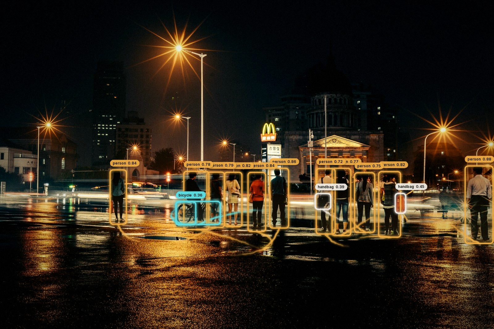
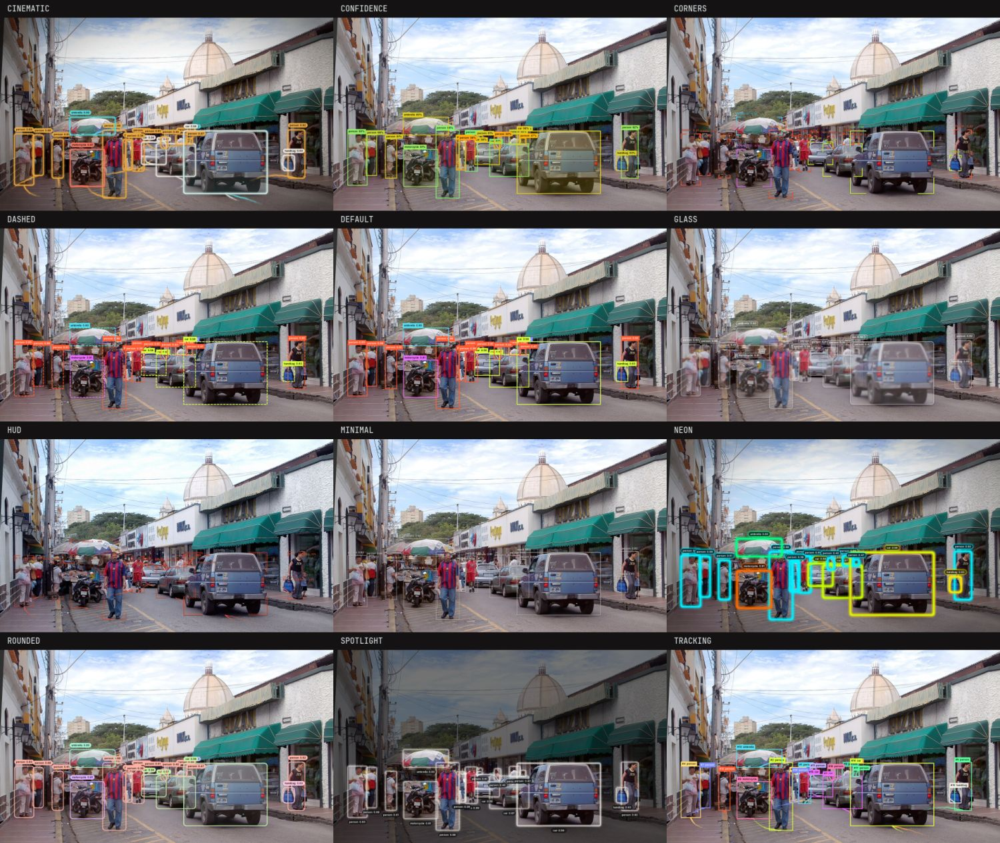
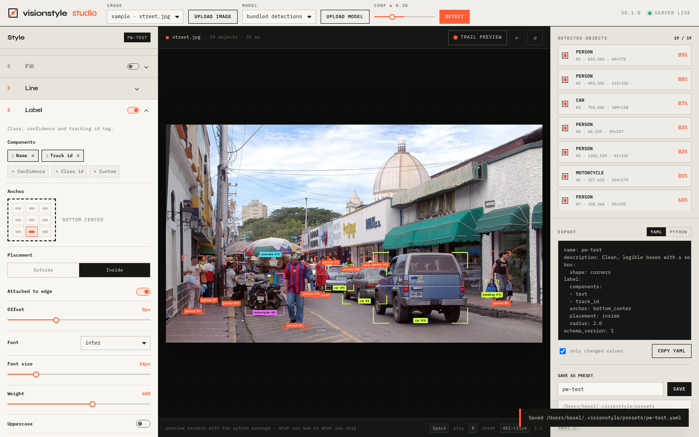

<p align="center">
  
</p>

# visionstyle

**Beautiful, fully configurable bounding boxes for object detection.**
Boxes, labels, fills, glow, glass, film grain and tracking trails — described by one `Style`,
tuned live in the Studio, saved as YAML, rendered with one call.

```python
import visionstyle as vs

dets = vs.Detections(xyxy=boxes, class_id=classes, confidence=scores, track_id=ids, names=model.names)
frame = vs.annotate(frame, dets, style="cinematic")
```

[](https://github.com/baselhusam/visionstyle/actions/workflows/ci.yml)


---

## Install

```bash
pip install visionstyle              # core: numpy, opencv-headless, pillow, pydantic, pyyaml
pip install "visionstyle[yolo]"      # + ultralytics for the demos / CLI model support
pip install "visionstyle[studio]"    # + fastapi/uvicorn for the Studio web app
pip install "visionstyle[all]"
```

## Presets

Twelve built-in looks. Every one is a plain YAML file you can copy and edit.

<p align="center"></p>

| Preset | Look |
|---|---|
| `default` | Clean rectangle, solid tag |
| `minimal` | Hairline outline, bare text |
| `corners` | Thin L-brackets, monospace tag |
| `rounded` | Rounded corners, gradient tint, pill label |
| `dashed` | Dashed perimeter with marching ants |
| `glass` | Frosted-glass fill and label |
| `neon` | Glowing hue-cycling gradient outlines |
| `hud` | Double frame, reticle marks, inside mono labels, dotted trails |
| `cinematic` | Rounded amber/teal frames, gradient fill, pill labels, glow, filmic grade |
| `tracking` | Bold per-track trails, id-first labels |
| `spotlight` | Dims everything outside the detections |
| `confidence` | Stroke and tag color follow the confidence score |

```bash
visionstyle presets list
visionstyle presets show cinematic
```

## Python API

```python
import cv2
import visionstyle as vs

frame = cv2.imread("street.jpg")

# 1. detections: boxes in pixels, everything else optional
dets = vs.Detections(
    xyxy=[[590, 650, 720, 1040], [1060, 660, 1520, 1000]],
    class_name=["person", "car"],
    confidence=[0.93, 0.88],
    track_id=[14, 31],
)
# or: dets = vs.Detections.from_ultralytics(model.predict(frame)[0])

# 2. a style: preset name, YAML path, or built in code
style = vs.Style.preset("cinematic")
style.label.components = ["track_id", "text"]   # every option is a typed attribute
style.trail.enabled = True

# 3. render. Keep one Annotator per video stream so trails/animations carry across frames.
annotator = vs.Annotator(style)
out = annotator.annotate(frame, dets)

# one-liner for stills
out = vs.annotate(frame, dets, style="minimal")
```

`Detections` accepts lists, NumPy arrays or torch tensors; `xyxy` is pixel `x1, y1, x2, y2`
(`Detections.from_xywh`, `from_xywh_topleft`, `from_dicts` also exist). Frames are BGR uint8 like
OpenCV; pass `rgb=True` for RGB arrays.

### What you can configure

| Section | Options |
|---|---|
| **Box** | `rectangle`, `rounded` (radius), `corners` (bracket length, curved elbows), `reticle`, `none`; double line; center mark |
| **Stroke** | thickness, opacity, color (`palette` per class/track, `confidence` ramp, or any hex/rgb/name) |
| **Fill** | on/off, opacity, color, `solid` / `gradient` (5 directions) / `hatch` |
| **Line** | `solid` / `dashed` / `dotted`, dash & gap sizes, multi-color `segments` or perimeter `gradient`, animation `march` / `hue_cycle` / `pulse` |
| **Label** | ordered components (`text`, `confidence`, `track_id`, `class_id`, `custom` template), 9 anchors × inside/outside, vertical tags on the sides, fonts (Inter, JetBrains Mono or your `.ttf`), size, weight, uppercase, `solid` / `pill` / `glass` / `underline` / `none` backgrounds, border, padding, formats |
| **Effects** | glow, shadow, frosted glass, spotlight dimming, vignette, film grain, color grade |
| **Tracking** | trail length, anchor (feet/center/top), `solid` / `dotted` / `dashed` / `ribbon`, fade & taper, smoothing, glow, points |
| **Global** | palette (built-in or custom list), per-class color overrides, confidence threshold, resolution scaling, fps |

All sizes are in *reference pixels* at ~1080p and scale automatically with the frame size
(`style.scale = "auto"`), so one style looks the same on a webcam and a 4K photo.

### Save and share styles

```python
style.save("my_style.yaml")                 # anywhere
style.save_preset("my-look")                # ~/.visionstyle/presets/my-look.yaml
vs.Style.preset("my-look")                  # found by name from now on
vs.presets.list()                           # built-in + yours
```

Lookup order: `$VISIONSTYLE_PRESETS_DIR` → `~/.visionstyle/presets` → built-ins → file path.

## Studio

Design a style visually, on your own image and model, and save it as a preset the package loads by name.

```bash
pip install "visionstyle[studio,yolo]"
visionstyle studio          # opens http://127.0.0.1:8420
```

<p align="center"></p>

* Upload an image or use the bundled samples; upload a `.pt` / `.onnx` model or use `yolo11n.pt`.
* Every section above is a live control. The preview is rendered by the **Python package itself**, so
  what you see is exactly what `annotate()` produces.
* Toggle objects on/off, isolate one, play line animations, preview trails on a still image.
* Export YAML (only changed values or everything), copy a Python snippet, or **Save as preset** into
  the default directory or any folder (`visionstyle studio --presets-dir ./styles`).

## CLI

```bash
visionstyle render photo.jpg -s neon --model yolo11n.pt -o out.jpg
visionstyle render clip.mp4  -s tracking --model yolo11n.pt --track -o out.mp4
visionstyle render 0         -s hud --model yolo11n.pt --track -o webcam.mp4   # webcam index
visionstyle render photo.jpg -d detections.json -s corners                    # no model needed
visionstyle gallery photo.jpg --model yolo11n.pt -o gallery.png               # every preset at once
visionstyle presets list | show NAME | export NAME -o my.yaml
visionstyle schema -o style.schema.json
```

`detections.json` is a list of `{"xyxy": [...], "class_name": "...", "confidence": 0.9, "track_id": 1}`.

## Development

```bash
uv sync --all-extras --group dev
uv run pytest && uv run ruff check . && uv run mypy src

cd studio && npm install
npm run dev            # Vite dev server on :5173 proxying /api to :8420
npm run build          # -> src/visionstyle/studio/static (bundled into the wheel)
```

When `src/visionstyle/style/schema.py` changes, regenerate the frontend schema and types:

```bash
uv run visionstyle schema -o studio/schema.json && (cd studio && npm run gen:types)
```

Releases: bump `__version__` in `src/visionstyle/__init__.py`, update `CHANGELOG.md`, tag `vX.Y.Z`
and push. `release.yml` builds the frontend + wheel, publishes to PyPI via trusted publishing (register
the `pypi` environment / publisher once on pypi.org) and creates a GitHub release.

## Credits

Sample photos: see [`src/visionstyle/assets/samples/CREDITS.md`](src/visionstyle/assets/samples/CREDITS.md).
Fonts: [Inter](https://rsms.me/inter/) and [JetBrains Mono](https://www.jetbrains.com/lp/mono/), both under the SIL Open Font License.

MIT © Basel Mather
